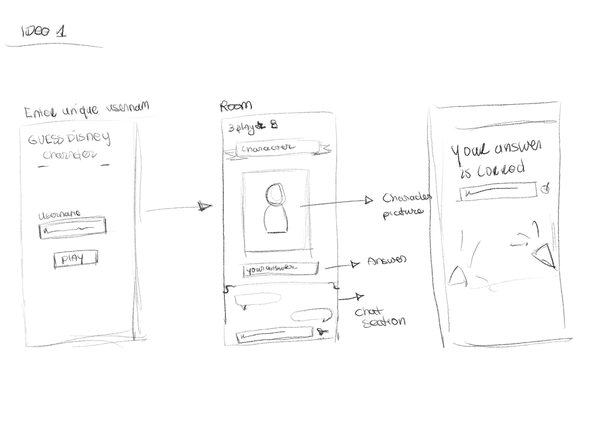

# Real-Time Web 

## Het Process
Voor deze cursus moeten we een chat ontwikkelen die in real time data ontvangt en uitdeelt (je kunt de data direct zien). Om te beginnen met deze cursus krijgen we de opdracht om samen als team aan de slag te gaan met het bouwen van een chatapplicatie. Zodat we een sterke basis hebben om te beginnen en dan kunnen we onze eigen functionaliteiten toevoegen om deze cursus te halen. Deze opdracht is behoorlijk tijdrovend, omdat we met dit project op maandag beginnen en de volgende dag (dinsdag) de opdracht moeten voltooien en feedback van de docenten moeten krijgen.

## Live Demo Links
<!-- 	Stabiele versie -->
- https://real-time-web-2223-production-287b.up.railway.app/
- https://realtime-webapp.adaptable.app/

---
# Inhoudsopgave
- [Het Process]()
- [Live Demo Links]()
- [Applicatie Installatie]()
- [Proof of Concept]()
  - [Idee 1: Guess the disney Character]()
  - [Idee 2: Woordenboek generator chat]()
  - [Idee 3: Watch together app]()
- [Het Concept]()
- [Dictionary  generator chat app]()
- [Functionaliteiten]()
- [Hoe gebruik je de App]()
- [Free Dictionary Api]()
- [Data Modeling]()
- [Data Life cycle Diagram]()
- [Real time Events]()
---
## Applicatie installatie
Om dit applicatie te installeren en gebruiken moet je een paar stappen doorlopen. 

### Wat heb je nodig:
- NPM
- node
- Express
- socket.io
- Nodemon
- ejs
- adaptable.io

### Clone repository

    git clone https://github.com/K3A101/css-to-the-rescue-2223.git

### NPM Installeren

    npm install

### Applicatie starten in developement

    npm run dev

### Applicatie te starten

    npm start

### Applicatie deployen
Om de applicatie live te zetten heb ik adaptable.io hosting platform gebruikt. Ik heb deze gebruikt omdat het ondersteund websocket. Je kan ook andere hosting platform gebruiken zoals railway.

---

## Proof of concept
Wat is een proof-of-concept. Proof of concept is een ontwerpmethode waarbij je nadenkt over drie mogelijke ideeën die kunnen worden geïmplementeerd. In mijn geval gebruik ik deze methode om drie concepten te creëren voor mijn real-time webapplicatie te bouwen. Voor elk concept maak ik een ruwe schets zodat mensen mijn ideeën beter kunnen begrijpen. En om ze te visualiseren. 

## Idee 1: Guess the disney character
Voor mijn eerste idee wil ik de Disney API gebruiken. Met deze API wil ik een multiplayer-game maken waarin spelers de Disney-personages kunnen raden. Voordat het spel begint, kan de speler een unieke gebruikersnaam aanmaken. Vervolgens worden alle geregistreerde spelers naar een kamer geleid. Als je de kamer binnenkomt, zie je een foto van een Disney-personage en een chatgedeelte. Iedereen typt zijn antwoord in de chat. De speler die het juiste antwoord raadt, krijgt een confetti op zijn scherm en een score. Na de viering. Het spel gaat verder en genereert nog een afbeelding van een personage, enzovoort.

### API = Disney Api
Hier is de link naar de [documentatie](https://disneyapi.dev/docs/)




### Functionaliteiten
- Spelers kunnen unieke gebruikersnaam maken
- Spelers kunnen met elkaar communiceren 
- Je kan zien hoeveel mensen momenteel online is
- Het spel bevat een score bord
- You can see how many players are online
- Eeen evet waar confettis worden gestoten voor de winnaar
- Disney karakters afbeeldingen worden uit de API gehaald. 

## Idee 2: Woordenboek generator chat
Mijn tweede idee is een chat waarbij  een groep mensen samen een  betekenis van het woord in een group chat genereert. Dus Iedereen kan een woord intypen en ze krijgen op basis darvan verschillende informatie over het woord zoals bij een woordenboek. Iedereen kunnen een hun  woordenlijst opstellen, door hun favoriete woorden in een lijstje op te slaan.


### API =   Free Dictionary APi
Hier is de link naar de [documntatie](https://dictionaryapi.dev/).


### Functionaliteiten
- Gebruikers kunnen unieke gebruikersnaam maken
- Gebruikers kunnen met elkaar communiceren in een groupchat
- Je kan zien hoeveel mensen momenteel online is
- Moet comncrete informatie geven van het woord'
- Gebruikers kunnen hub woorden opslaan in een woordenlijst
  

## Idee 3 - Watch together App
Het laatste concept is een app waar mensen gezamenlijk review kan geven over een boek of film.  Dus mensen kunnen een boek/film kiezen die ze willen beoordelen. En daarna in een forum feedback plaatsen.  Ik heb ook een andere idee een soort van live chat te geven waarmee gebruikers commentaren kan plaatsen terwijl ze  live een fragment bekijk. Denk aan facebook live.

### API - Goodreads API

---
# Het concept
## Dictionary generator chat
Ik wil voor mij concept een woordenboek generator maken. Dus een groep mensen komen in een chatroom terecht en dan kunnen ze op basis van een woord die ze hebben ingevuld een overzicht maken met woordenboek eigenschappen . De woorden die genereert zijn kun je een woordenlijst maken en iedereen kunnen de woordenlijst downloaden en of bewaren. 

## Functionaliteiten 
- [x] Gebruikers kunnen gebruikersnaam maken
- [x] Gerbruikers komen op een gebruikerslijst komen te staan
- [x] Je kan zien wie online is.
- [x] Gebruikers kunnen met elkaar communiceren in een groupchat.
- [x] Gebruikers kunnen woorden invullen om de beschrijving te genereren
- [x] Moet concrete informatie geven van het woord'
- [ ] Gebruikers kunnen hun woorden opslaan in een woordenboeklijst
- [ ] Gebruikers kunnen in room gaan
- [x] Kijken wie er bijgekomen is in de chat
- [ ] Je kan zien welke gebruiker aan het type is


  
## Must have
- [x] Gebruikers kunnen gebruikersnaam maken
- [x] Gerbruikers komen op een gebruikerslijst komen te staan
- [x] Je kan zien wie online is.
- [x] Gebruikers kunnen met elkaar communiceren in een groupchat.
- [x] Gebruikers kunnen woorden invullen om de beschrijving te genereren
- [x] Moet concrete informatie geven van het woord'

## Should have
- [ ] Instructie hoe je de app gebruikt
- [ ] Moet werkend zijn op mobiel

## Could have
- [ ] Gebruikers kunnen in room gaan
- [ ] Gebruikers krijgen notifactie dat iemand is daarbij gekomen
- [ ] Gebruikers kunnen hun woorden opslaan in een woordenboeklijst
- [ ] Gebruikers kunnen de beschrijving van de woord kopieren met een button 

## Technieken
- [ ] De gebruikersnaam pagina verbergen wanneer de gebruiker op de button klikt
- [ ] Een overzicht van de woord naast de chat
- [ ] Een plek waar je de woord kan invoeren
- [ ] Een overzicht lijst met alle gebruikers die nu in de room is

## Hoe gebruik je de app?

### Een gebruikersnaam aanmaken

### In de Chatroom gaan 


### Een woord in de  Input invullen?

## Schetsen


---
# API
## Free dictionary API
Om mijn concept aan de praat te krijgen ga ik de Free API Dictionary Api gebruiken. Hoe de Api werkt is dat het woord die je invult, word dan je endpoint. Verder wordt via de endpoint een array gegeneert met verschillende eigenschappen van het woord. Hieronder is er een voorbeeld van de een woord.

### Eindpont van het woord hello
`GET https://api.dictionaryapi.dev/api/v2/entries/en/hello`

### De response
Dit is wat je terugkrijgt vanuit de API. 
Om de response overzicht te krijgen heb ik insomia.rest gebruikt. 


```json
[
	{
		"word": "hello",
		"phonetics": [
			{
				"audio": "https://api.dictionaryapi.dev/media/pronunciations/en/hello-au.mp3",
				"sourceUrl": "https://commons.wikimedia.org/w/index.php?curid=75797336",
				"license": {
					"name": "BY-SA 4.0",
					"url": "https://creativecommons.org/licenses/by-sa/4.0"
				}
			},
			{
				"text": "/həˈləʊ/",
				"audio": "https://api.dictionaryapi.dev/media/pronunciations/en/hello-uk.mp3",
				"sourceUrl": "https://commons.wikimedia.org/w/index.php?curid=9021983",
				"license": {
					"name": "BY 3.0 US",
					"url": "https://creativecommons.org/licenses/by/3.0/us"
				}
			},
			{
				"text": "/həˈloʊ/",
				"audio": ""
			}
		],
		"meanings": [
			{
				"partOfSpeech": "noun",
				"definitions": [
					{
						"definition": "\"Hello!\" or an equivalent greeting.",
						"synonyms": [],
						"antonyms": []
					}
				],
				"synonyms": [
					"greeting"
				],
				"antonyms": []
			},
			{
				"partOfSpeech": "verb",
				"definitions": [
					{
						"definition": "To greet with \"hello\".",
						"synonyms": [],
						"antonyms": []
					}
				],
				"synonyms": [],
				"antonyms": []
			},
			{
				"partOfSpeech": "interjection",
				"definitions": [
					{
						"definition": "A greeting (salutation) said when meeting someone or acknowledging someone’s arrival or presence.",
						"synonyms": [],
						"antonyms": [],
						"example": "Hello, everyone."
					},
					{
						"definition": "A greeting used when answering the telephone.",
						"synonyms": [],
						"antonyms": [],
						"example": "Hello? How may I help you?"
					},
					{
						"definition": "A call for response if it is not clear if anyone is present or listening, or if a telephone conversation may have been disconnected.",
						"synonyms": [],
						"antonyms": [],
						"example": "Hello? Is anyone there?"
					},
					{
						"definition": "Used sarcastically to imply that the person addressed or referred to has done something the speaker or writer considers to be foolish.",
						"synonyms": [],
						"antonyms": [],
						"example": "You just tried to start your car with your cell phone. Hello?"
					},
					{
						"definition": "An expression of puzzlement or discovery.",
						"synonyms": [],
						"antonyms": [],
						"example": "Hello! What’s going on here?"
					}
				],
				"synonyms": [],
				"antonyms": [
					"bye",
					"goodbye"
				]
			}
		],
		"license": {
			"name": "CC BY-SA 3.0",
			"url": "https://creativecommons.org/licenses/by-sa/3.0"
		},
		"sourceUrls": [
			"https://en.wiktionary.org/wiki/hello"
		]
	}
]
```

## Data modeling
### Versie 1


## Data Lifecycle Diagram
---
# Real time events
Voor het communicatie tussen de server en de clients.  Heb ik verschillende real time events gemaakt.
 
 ### Nieuwe gebruiker
Wanneer een nieuwe gebruiker in de chat komt wordt de `new user` event gestuurd van de client naar de server. De server  luistert naar de `new user` event en als er een nieuwe gebruiker een username geeft, wordt de event naar alle clients gestuurd dat er een gebruiker is erij gekomen.

### Online gebruikers 
De ingelogde gebruikers worden in de server opgeslagen in de onlineUser variabele. De opgeslagen gebruikers worden verstuurd onder de `get online user` event. De event word verstuurd naar alle clients. De Client luistert voor de event en zet de online gebruikers in een lijst. 

 ### Chat bericht
 De chat is helemaal opgebouwd op basis van de de woord die de gebruiker had ingevuld. Je kan met meerder mensen spreker maar je kan ook  met een woord, betekenis  van het woord genereren. Het gestuurde bericht wordt vanuit de client naar de server gestuurd onder de chat message event. De server stuurt de berichten naar alle clients. 

 ### Gebruiker aan het typen
Wanneer een gebruiker aan het typen is wordt `typing` event getriggered naar de event wordt gestuurd naar de server gestuurd. De server luister naar de typing event en verstuurt de bericht dat de currentgebruiker is aan het typen naar iedereen behalve degenen die het bericht had verstuurt.  

 ### Gegenereerde woorden uit de API
 De woorden die de gebruiker typt wordt tegelijkertijd gestuurd naar de API, De API stuur de data terug naar de client en de client stuurt data naar de server met de `wordData` event. De server stuurt de data naar de clients en in de client wordt de data weergegeven. Wat wordt weergegven is de woord spelling, audio, en de betekenis. 


## ⚖ License
[MIT](https://github.com/K3A101/real-time-web-2223/blob/main/LICENSE) 
