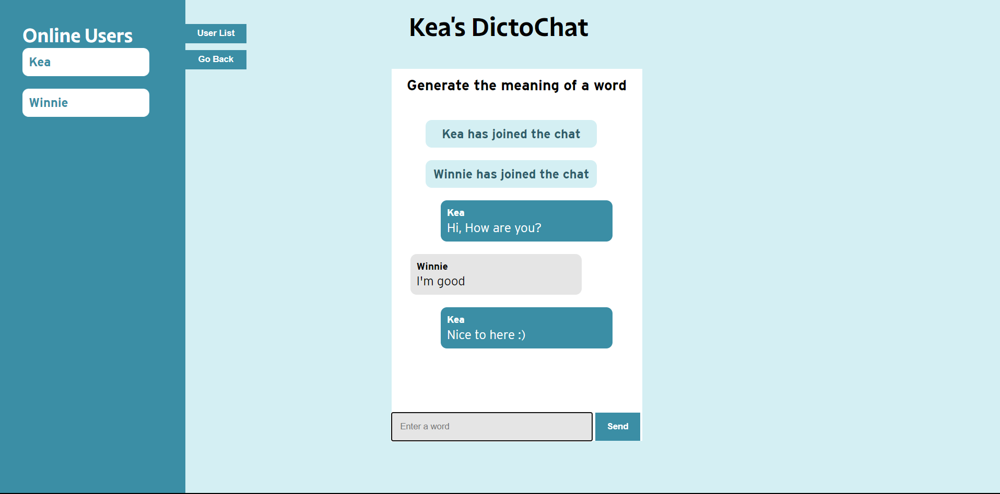
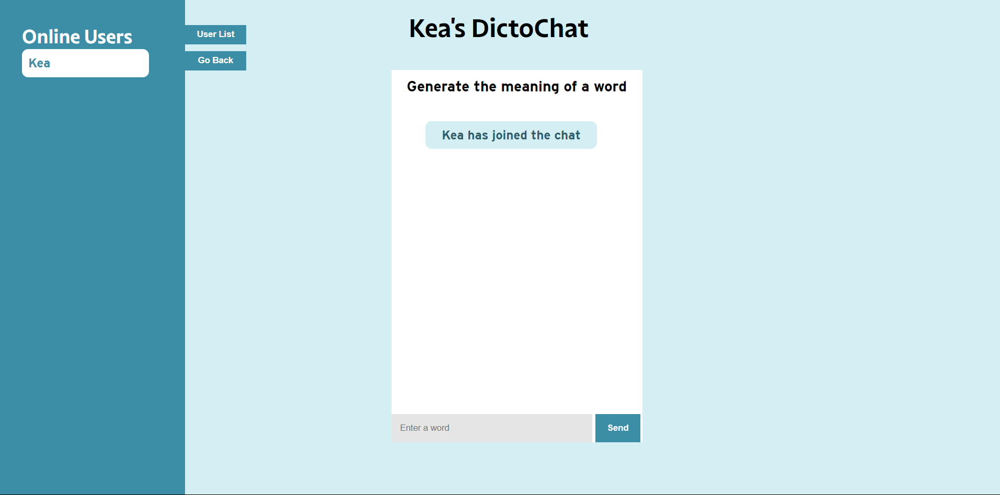
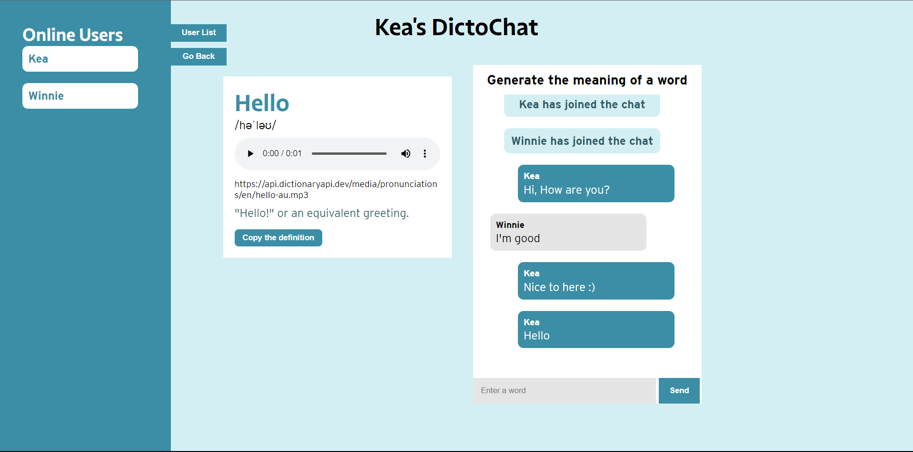
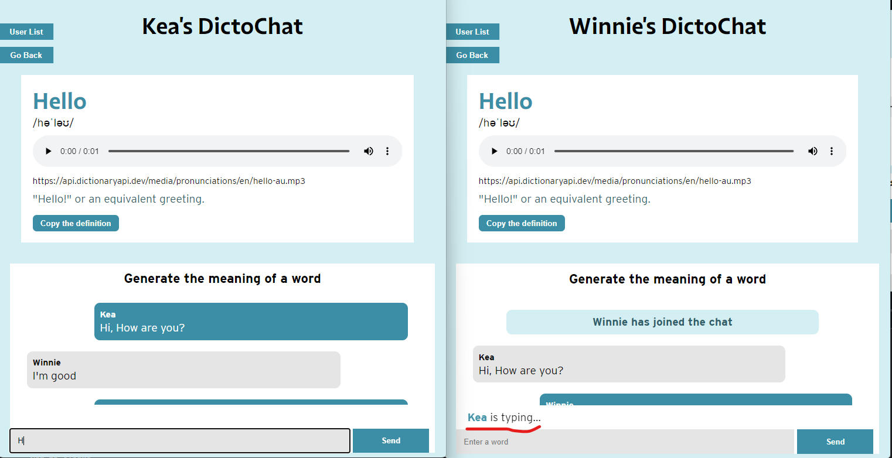

# Real-Time Web 

## Het Process
Voor deze cursus ga ik een realtime chat applicatie  ontwikkelen die in real time data ontvangt en uitdeelt (je kunt de data direct zien). Ik heb technieken zoals socket.io en express.js gebruik voor het communicatie  tussen de server en client. Met deze techniek kan ik data real time versturen aan beide kanten op dezelfde tijd. 

## Live Demo Links
<!-- 	Stabiele versie -->
Ik heb mijn applicatie gehost op adaptable and railway. Maar railway is stabieler dus gebruikt die astublieft.
- Railway: https://real-time-web-2223-production-287b.up.railway.app/
- Adaptable: https://realtime-webapp.adaptable.app/


## Dictionary generator chat - DictoChat
Dictionary generator chat oftewel DictoChat is een chat  waarbij  een groep mensen samen een  betekenis van het woord in een group chat genereert. Dus iedereen kan een woord intypen en ze krijgen op basis daarvan verschillende informatie over het woord zoals bij een woordenboek. Soort informatie die je kan zien zijn: hoe je het woord uitspraak, het definitie, en de spelling. 


---
# Inhoudsopgave
- [Het Process](#het-process)
- [Live Demo Links](#live-demo-links)
- [Applicatie Installatie](#applicatie-installatie)
- [Proof of Concept](#proof-of-concept)
  - [Idee 1: Guess the disney Character](#idee-1-guess-the-disney-character)
  - [Idee 2: Woordenboek generator chat](#idee-2-woordenboek-generator-chat)
  - [Idee 3: Watch together app](#idee-3---watch-together-app)
- [Het Concept](#het-concept)
- [Dictionary  generator chat app](#dictionary-generator-chat)
- [Functionaliteiten](#core-functionaliteiten)
- [Moscow methode](#moscow-methode)
- [Hoe gebruik je de App](#hoe-gebruik-je-de-app)
- [Free Dictionary Api](#free-dictionary-api)
- [Data Modeling](#data-modeling)
- [Data Life cycle Diagram](#data-lifecycle-diagram)
- [Real time Events](#real-time-events)
- [Ui stack](#ui-stack)
- [Geen verbinding met de server](#geen-verbinding-met-de-server)
- [Bronnen](#bronnen)
---
## Applicatie installatie
Om dit applicatie te installeren en gebruiken moet je een paar stappen doorlopen. 

### Wat heb je nodig:
- NPM
- node
- Express
- socket.io
- Nodemon
- ejs
- adaptable.io
- raillway.app


### NPM  Dependencies
- Nodemon
- Express
- socket.io 
- ejs template engine

### Clone repository
Om dit project te gebruiken moet je eerst dit repository clonen en  lokaal via een editor toevoegen.

    git clone https://github.com/K3A101/css-to-the-rescue-2223.git

### NPM Installeren

Wanneer je dit project had geïnstalleerd op je eigen computer moet je in de terminal dit commando onderaan uitvoeren. Hier kan je al mijn npm dependencies installeren en kan je de applicatie starten. 
    npm install

### Server van de applicatie starten in developement
Als je npm run dev commando uitvoert, kun je de server starter op localhost http://localhost:4242

    npm run dev

### Applicatie te starten

    npm start

### Applicatie deployen
Om de applicatie live te zetten heb ik adaptable.io hosting platform gebruikt. Ik heb deze gebruikt omdat het ondersteund websocket. Je kan ook andere hosting platform gebruiken zoals railway.

---
### Express Server implementeren
Om een express server te implementeren moet je eerst de express module installeren. Dit kan je doen door de volgende commando in je terminal te typen.

```
npm install express
```

Om de express server te starten moet je de volgende code in je server.js bestand typen.
```javascript
	const express = require('express');
	const app = express();
	const port = 3000;
	
	app.use(express.static('public'));
	
	app.listen(port, () => {
	  console.log(`Example app listening at http://localhost:${port}`)
	})


```
### Socket.io implementeren
Om socket.io te implementeren moet je eerst de socket.io module installeren. Dit kan je doen door de volgende commando in je terminal te typen.

	npm install socket.io

Om de socket.io server te starten moet je de volgende code in je app.js bestand typen.

<details>
<summary> De code</summary>


```javascript

	const express = require('express');
	const app = express();
	const port = 3000;
	
	app.use(express.static('public'));
	
	const server = app.listen(port, () => {
	  console.log(`Example app listening at http://localhost:${port}`)
	})
	
	const io = require('socket.io')(server);
	
	io.on('connection', (socket) => {
	  console.log('a user connected');
	});

```
</details>

### Nodemon implementeren
Om nodemon te implementeren moet je eerst de nodemon module installeren. Dit kan je doen door de volgende commando in je terminal te typen.

	npm install nodemon

Om de nodemon server te starten moet je de volgende code in je package.json bestand typen.

	"scripts": {
	    "dev": "nodemon  -L app.js"
	  },

## EJS implementeren
Om EJS te implementeren moet je eerst de EJS module installeren. Dit kan je doen door de volgende commando in je terminal te typen.

	npm install ejs

Om de EJS server te starten moet je de volgende code in je server.js bestand typen.

	app.set('view engine', 'ejs');


---

## Proof of concept
Wat is een proof-of-concept. Proof of concept is een ontwerpmethode waarbij je nadenkt over drie mogelijke ideeën die kunnen worden geïmplementeerd. In mijn geval gebruik ik deze methode om drie concepten te creëren voor mijn real-time webapplicatie te bouwen. Voor elk concept maak ik een ruwe schets zodat mensen mijn ideeën beter kunnen begrijpen. En om ze te visualiseren. 

## Idee 1: Guess the disney character
Voor mijn eerste idee wil ik de Disney API gebruiken. Met deze API wil ik een multiplayer-game maken waarin spelers de Disney-personages kunnen raden. Voordat het spel begint, kan de speler een unieke gebruikersnaam aanmaken. Vervolgens worden alle geregistreerde spelers naar een kamer geleid. Als je de kamer binnenkomt, zie je een foto van een Disney-personage en een chatgedeelte. Iedereen typt zijn antwoord in de chat. De speler die het juiste antwoord raadt, krijgt een confetti op zijn scherm en een score. Na de viering. Het spel gaat verder en genereert nog een afbeelding van een personage, enzovoort.

### API = Disney Api
In deze API krijg je allerlei informatie over de 
Hier is de link naar de [documentatie](https://disneyapi.dev/docs/)


### Functionaliteiten
- Spelers kunnen unieke gebruikersnaam maken
- Spelers kunnen met elkaar communiceren 
- Je kan zien hoeveel mensen momenteel online is
- Het spel bevat een score bord
- You can see how many players are online
- Eeen evet waar confettis worden gestoten voor de winnaar
- Disney karakters afbeeldingen worden uit de API gehaald. 

## Idee 2: Woordenboek generator chat
Mijn tweede idee is een chat waarbij  een groep mensen samen een  betekenis van het woord in een groep chat genereert. Dus Iedereen kan een woord intypen en ze krijgen op basis darvan verschillende informatie over het woord zoals bij een woordenboek. Iedereen kunnen een hun  woordenlijst opstellen, door hun favoriete woorden in een lijstje op te slaan.


### API =   Free Dictionary APi
Hier is de link naar de [documntatie](https://dictionaryapi.dev/).


### Functionaliteiten
- Gebruikers kunnen unieke gebruikersnaam maken
- Gebruikers kunnen met elkaar communiceren in een groupchat
- Je kan zien hoeveel mensen momenteel online is
- Moet comncrete informatie geven van het woord'
- Gebruikers kunnen hub woorden opslaan in een woordenlijst
  

## Idee 3 - Watch together App
Het laatste concept is een app waar mensen gezamenlijk review kan geven over een boek of film.  Dus mensen kunnen een boek/film kiezen die ze willen beoordelen. En daarna in een forum feedback plaatsen.  Ik heb ook een andere idee een soort van live chat te geven waarmee gebruikers commentaren kan plaatsen terwijl ze  live een fragment bekijk. Denk aan facebook live.

### API - Goodreads API
Een api die ik hiervoor kan gebruiken is de goodreads api. Hiermee kan je verschillende informatie krijgen over eebn boek. Bijvoorbeeld de titel, auteur, aantal beoordeling enz.

Hier is de ;ink naar de API [documentatie](https://www.goodreads.com/api).

---
# Het concept
## Dictionary generator chat - DictoChat
Dictionary generator chat oftewel DictoChat is een chat  waarbij  een groep mensen samen een  betekenis van het woord in een group chat genereert. Dus iedereen kan een woord intypen en ze krijgen op basis daarvan verschillende informatie over het woord zoals bij een woordenboek. Soort informatie die je kan zien zijn: hoe je het woord uitspraak, het definitie, en de spelling. 

## Schetsen


## Core Functionaliteiten van DictoChat
- [x] Gebruikers kunnen gebruikersnaam maken
- [x] Gerbruikers komen op een gebruikerslijst komen te staan
- [x] Je kan zien wie online is.
- [x] Gebruikers kunnen met elkaar communiceren in een groupchat.
- [x] Gebruikers kunnen woorden invullen om de beschrijving te genereren
- [x] Moet concrete informatie geven van het woord'
- [x] Kijken wie er bijgekomen is in de chat
- [X] Je kan zien welke gebruiker aan het type is

## MOSCOW methode
## Must have
- [x] Gebruikers kunnen gebruikersnaam maken
- [x] Gerbruikers komen op een gebruikerslijst komen te staan
- [x] Je kan zien wie online is.
- [x] Gebruikers kunnen met elkaar communiceren in een groupchat.
- [x] Gebruikers kunnen woorden invullen om het definitie te genereren
- [x] Moet concrete informatie geven van het woord'
- [x] Berichten worden opgeslagen
- [x] Data life cycle diagram
 

## Should have
- [ ] Instructie hoe je de app gebruikt
- [x] Moet werkend zijn op mobiel
- [ ] Offline ondersteuning 

## Could have
- [ ] Gebruikers kunnen een bericht krijgen wanneer een woord niet gevonden kan worden
- [ ] Gebruikers kunnen in room gaan
- [ ] Gebruikers krijgen notifactie dat iemand is daarbij gekomen
- [ ] Gebruikers kunnen hun woorden opslaan in een woordenboeklijst
- [x] Gebruikers kunnen de beschrijving van de woord kopieren met een button 

## Would have but not right now
- [ ] Een melding die aangeeft dat er geen informatie kunnen vinden van het woord.
- [ ] Aangeven hoelaat de berichten zijn gestuurd.
- [ ] Eigen gegenereerde gebruiker wordt opvallender dan de rest. Dan kunnen ze zie van wie wat is.

## Technieken
- [x] De gebruikersnaam pagina verbergen wanneer de gebruiker op de button klikt
- [x] Een overzicht van de woord naast de chat
- [x] Een plek waar je de woord kan invoeren
- [x] Een overzicht lijst met alle gebruikers die nu in de room is

## Hoe gebruik je de app?
### Een gebruikersnaam aanmaken
Wanneer de gebruiker naar de homepagina terecht komt, kunnen ze een gebruikersnaam aanmaken. Wanneer ze de `join chat` klikt, wordt de gebruikersnaam formulier verbergt en de chat container wordt zichtbaar.


### In de Chatroom gaan 
Je gaat naar de chatpagina en het eerste wat je ziet is een bericht dat je bij is gekomen in de chat. Iedereen die al was ingelogd kun dit bericht zien. 



### Met elkaar berichten sturen
Wanneer iedereen in de chat stuurt kunnen ze  normaal naar elkaar berichten sturen. 


### Definitie van het woord genereren
Naast dat je met elkaar berichten kunnen sturen, kun je de definitie van het woord krijgen. Om dit functionaliteit te gebruiken moet je een word in de chat versturen, na enkele seconde komen het definitie van het woord tevoorschijn. Als je het wilt kun je de betekenis  van het woord kopieren.




### Gebruikers is aan het typen
Wanneer een  gebruiker aan het typen is, krijgen de rest een bericht dat een specifiek gebruiker aan het typen is. 



---
# API
## Free dictionary API
Om mijn concept aan de praat te krijgen ga ik de Free API Dictionary Api gebruiken. Free dictionary API is een api die je verschillende informatie geeft over een woord. De informatie die je krijgt zijn: de definitie, de spelling, de uitspraak enz. 
 Hoe de Api werkt is dat het woord die je invult, wordt dan je endpoint. Verder wordt via de endpoint een array gegeneert met verschillende eigenschappen van het woord. Hieronder is er een voorbeeld van de een woord.

### Eindpont van het woord hello
Wanneer de gebruiker een woord invult, wordt de woord de endpoint. 
`GET https://api.dictionaryapi.dev/api/v2/entries/en/hello`

### De response
Dit is wat je terugkrijgt vanuit de API. 
Om de response overzicht te krijgen heb ik insomia.rest gebruikt.
 

<details>
<summary> Het structuur van de API</summary>

```json
[
	{
		"word": "hello",
		"phonetics": [
			{
				"audio": "https://api.dictionaryapi.dev/media/pronunciations/en/hello-au.mp3",
				"sourceUrl": "https://commons.wikimedia.org/w/index.php?curid=75797336",
				"license": {
					"name": "BY-SA 4.0",
					"url": "https://creativecommons.org/licenses/by-sa/4.0"
				}
			},
			{
				"text": "/həˈləʊ/",
				"audio": "https://api.dictionaryapi.dev/media/pronunciations/en/hello-uk.mp3",
				"sourceUrl": "https://commons.wikimedia.org/w/index.php?curid=9021983",
				"license": {
					"name": "BY 3.0 US",
					"url": "https://creativecommons.org/licenses/by/3.0/us"
				}
			},
			{
				"text": "/həˈloʊ/",
				"audio": ""
			}
		],
		"meanings": [
			{
				"partOfSpeech": "noun",
				"definitions": [
					{
						"definition": "\"Hello!\" or an equivalent greeting.",
						"synonyms": [],
						"antonyms": []
					}
				],
				"synonyms": [
					"greeting"
				],
				"antonyms": []
			},
			{
				"partOfSpeech": "verb",
				"definitions": [
					{
						"definition": "To greet with \"hello\".",
						"synonyms": [],
						"antonyms": []
					}
				],
				"synonyms": [],
				"antonyms": []
			},
			{
				"partOfSpeech": "interjection",
				"definitions": [
					{
						"definition": "A greeting (salutation) said when meeting someone or acknowledging someone’s arrival or presence.",
						"synonyms": [],
						"antonyms": [],
						"example": "Hello, everyone."
					},
					{
						"definition": "A greeting used when answering the telephone.",
						"synonyms": [],
						"antonyms": [],
						"example": "Hello? How may I help you?"
					},
					{
						"definition": "A call for response if it is not clear if anyone is present or listening, or if a telephone conversation may have been disconnected.",
						"synonyms": [],
						"antonyms": [],
						"example": "Hello? Is anyone there?"
					},
					{
						"definition": "Used sarcastically to imply that the person addressed or referred to has done something the speaker or writer considers to be foolish.",
						"synonyms": [],
						"antonyms": [],
						"example": "You just tried to start your car with your cell phone. Hello?"
					},
					{
						"definition": "An expression of puzzlement or discovery.",
						"synonyms": [],
						"antonyms": [],
						"example": "Hello! What’s going on here?"
					}
				],
				"synonyms": [],
				"antonyms": [
					"bye",
					"goodbye"
				]
			}
		],
		"license": {
			"name": "CC BY-SA 3.0",
			"url": "https://creativecommons.org/licenses/by-sa/3.0"
		},
		"sourceUrls": [
			"https://en.wiktionary.org/wiki/hello"
		]
	}
]
```
</details>

Niet alle woorden heeft dezelfde structuur. Hier kon ik de map filter, reduce methode gebruiken. Als ik tijd had, zou ik dit manier proberen. 

## Hoe werkt de API in de Chat?

```javascript
sendMessage.addEventListener('click', (e) => {

    const typingUser = currentUser;
    e.preventDefault();
    let word = wordInput.value;
    fetch('https://api.dictionaryapi.dev/api/v2/entries/en/' + word)
        // fetch('/new-word' + word)
        .then(response => response.json())
        .then(data => {
            console.log(data)
            socket.emit('wordData', data); //DE data opgehaald van de API wordt gestuurd naar de server
        }).catch(err => {
            console.log(err)
        })

    if (word.length > 0) {

        //Ik maak een array van object aan met de waarde van de username en de message
        const chat = {
            username: currentUser,
            message: word
        }
        //De chat message event wordt gestuurd met de chat array als parameter
        //De chat array bevat de username en de message
        socket.emit('chat message', chat); //verstuurd een chat message  event naar de server met de chat object array als data
        socket.emit('stop typing', typingUser);
        wordInput.value = '';
    }
})

```
### Toelichting
Dit is een click eventlistener op het verstuur button. In deze functie gebeurd er een paar dingen. Ten eerste de ingevulde woord wordt in `word` variabele opgeslagen. De waarde daarvan wordt gestuurd geplaatst in de API URL. Verder wordt de data die uit de API is opgehaald naar de server gestuurd  met de `wordData` event.  In de server wordt de data gestuurd naar alle verbonden client. Terug bij deze functie, de data wordt opgehaald. In dezelfe click event heb ik nog twee socket.io events togevoegd. 

In de chat message event worden de bericht die de huidige gebruiker typt, naar de server gestuurd. De rest van de gebruiker in de chat kunnen dit bericht ook zien. Ook de `user is typing` gaat ook weg.

Dus in het kort, wanneer de gebruiker op de` sendMessage` button klikt, wordt berichten aan elkaar gestuurd, maar tegelijkertijd de betekenis van een  woord wordt vanuit de API opgehaald en naar alle verbonden client gestuurd. Het wordt ook aangeven bij de rest dat de persoon is gestopt met typen. 

---

## Data modeling
Dit is een overzicht, van de API. 
### Versie 1


---

## Data Lifecycle Diagram


Dit is mijn data life cycle  diagram. Het bestaat uit drie compontenten. De server, de client en de API. In de client wordt de gebruikersnaam gemaakt en  in de server opgeslagen en via de server wordt het naar alle verbonden client gestuurd. De gebruiker kan een woord invullen en op de verstuur knop klikken. Het woord wordt naar de API gestuurd en de betekenis  van het woord  wordt terug gestuurd naar de server. De server stuurt de data naar alle verbonden client. Tussen de client en de server verschillende real time events verstuurd en ontvangt. 
 <details>
<summary>Oude versies</summary>


### Versie 2


</details>

---
# Real time events
Voor het communicatie tussen de server en de clients.  Heb ik verschillende real time events gemaakt.
- `connection` Event wordt uitgevoerd wanneer de gebruiker verbinding maakt met de server
- `new-user` Event wordt uigevoerd Wanneer de gebruiker een nieuwe gebruiker aanmaakt
- `user joined` Event die aangeeft dat een user is in de chat bijgekomen
- `get online users` Met deze event worden de aangemelde gebruikers in de server opgeslagen in een lijst komen te staan.
- `typing` Event die laat zien dat een gebruiker aan het typen is.
- `stop typing` Event wanneer  de gebruiker gestopt is met typen
- `wordData` Event die de API data wordt naar de server gestuurd om dan naar alle clients te sturen
- `chat message` Event waar de gebruikers met elkaar berichten kan sturen in een chat room
- `chat history` Maximaal 50 berichten worden opgeslagen, de nieuwe gebruikers die nog binnen komen kunnen alsnog de oude berichten zien. 
- `word descripton history` geld ook bij het woord definities, maximaal 50 stukjes worden in de server bewaard. 
- `connect` De event ga checken of de applicatie verbinding heeft met de server. Als er geen verbinding is wordt een bericht getsuurd naar de gebruikers dat hij offline is. 
- `disconnect` Event die aangeeft dat de client niet meer verbonden is met de server.

 ## Real time event 
<details>

<summary>connection</summary>

### Connection

### Socket event: Connection

Wanneer de gebruiker verbinding maakt met de server, wordt de `connection` event uitgevoerd. De server stuurt een bericht naar de client dat de gebruiker is verbonden met de server.

#### Server
```javascript

//server

io.on('connection', (socket) => {
    console.log('a user connected');
    socket.emit('connection', 'You are connected to the server');

    // Meerder socket events
    socket.on('disconnect', () => {
        console.log('user disconnected');
    });
});

```


</details>


<details>
<summary>new-user</summary>

### Nieuwe gebruiker

### Socket event: New user
Hier ga de gebruiker een gebruikersnaam aanmaken. Wanner ze op de knop klikt, wordt twee events naar de server gestuurd. Met de user joined event wordt het zichtbaar voor de gebruiker wie in de chat is aangekomen. 
Wanneer een nieuwe gebruiker in de chat komt wordt de `new user` event gestuurd van de client naar de server. De server  luistert naar de `new user` event en als er een nieuwe gebruiker een username geeft, wordt de event naar alle clients gestuurd dat er een gebruiker  erij zijn gekomen.

#### Client
```javascript
//client
const displayedUsername = document.querySelector('.displayed-username');
const usernameForm = document.querySelector('.username-form');
const usernameInput = document.querySelector('#username-input');
const loader = document.querySelector('.loader');
let currentUser;
// event wordt verstuurd naar de server
createUserBtn.addEventListener('click', (e) => {
    e.preventDefault();
    backBtn.classList.remove('hide-back-btn');
    // const usernameInput = document.querySelector('#username-input');
    const username = usernameInput.value.trim();
    if (username.length > 0) {
        socket.emit('new-user', username);
        socket.emit('user joined', username);
        currentUser = username;
        usernameForm.classList.add('hidden');
        chat.classList.remove('hidden');
      
      loader.classList.add('loader-screen');
    //   Na 2 seconden wordt de loader verwijderd
        setTimeout(() => {
            loader.classList.remove('loader-screen');
        }, 2000);
        
        displayedUsername.innerHTML = `${username}'s ` + '';
    }

    console.log('New user created')

});

//client 
socket.on('new-user', (username) => {
    console.log(username + ' has joined the chat');
    let user = document.createElement('li');
    user.innerHTML = `${username}`;
    userList.appendChild(user);
});

```
#### Server
```javascript
let onlineUsers = {};
console.log('onlineUsers', onlineUsers)
// server
    socket.on('new-user', (username) => {
        console.log(`${username} has joined the chat`);
        //Save the username as key to access the user's socket id
        onlineUsers[username] = socket.id;
        socket['username'] = username;
        io.emit('new-user', username);
    })
```


</details>

<details>
<summary>user joined</summary>

### User is bijgekomen

#### Socket event: user joined
Dit event wordt uitgevoerd naast de new user event. Wanneer de gebruiker een naam heeft gemaakt,  wordt hij verstuurd naar de chat room. Iedereen die al in de chat room zijn krijgen een melding dat een nieuwe gebruiker is bijgekomen. 

#### client 
```javascript
const displayedUsername = document.querySelector('.displayed-username');
const createUserBtn = document.querySelector('#create-user-btn');
const usernameForm = document.querySelector('.username-form');
const usernameInput = document.querySelector('#username-input');
let currentUser;

createUserBtn.addEventListener('click', (e) => {
    e.preventDefault();
    backBtn.classList.remove('hide-back-btn');
    // const usernameInput = document.querySelector('#username-input');
    const username = usernameInput.value.trim();
    if (username.length > 0) {
        socket.emit('new-user', username);
        socket.emit('user joined', username);
        currentUser = username;
        usernameForm.classList.add('hidden');
        chat.classList.remove('hidden');
      
      loader.classList.add('loader-screen');
    //   Na 2 seconden wordt de loader verwijderd
        setTimeout(() => {
            loader.classList.remove('loader-screen');
        }, 2000);
        
        displayedUsername.innerHTML = `${username}'s ` + '';
    }

    console.log('New user created')

});


socket.on('user joined', (username) => {
    console.log(username + ' has joined the chat');
    let user = document.createElement('li');
    user.innerHTML = `${username} has joined the chat`;
    chatContainer.appendChild(user);
    chatContainer.scrollTop = chatContainer.scrollHeight;
});


```
#### Server
```javascript
let onlineUsers = {};
console.log('onlineUsers', onlineUsers)

socket.on('user joined', (username) => {
        console.log(`${username} has joined the chat`);
        //Save the username as key to access the user's socket id
        onlineUsers[username] = socket.id;
        socket['username'] = username;
        io.emit('user joined', username);
    })
```
</details> 

<details>
<summary>Get online users</summary>

### Lijst met alle online gebruikers

#### Socket event: get online users
De gebruikers met een naam worden dan opgeslagen naar de server onder de get online users event. De Opgeslagen gebruikersnamen worden vanuit de server opgehaald en naar de client gestuurd. Dus wanneer de gebruiker naar de homepagina komt, kunnen ze alle online gebruikers zien die momenteel in de chat zijn. 

#### client
```javascript
const userList = document.querySelector('#user-online');
let currentUser;
socket.emit('get online users')


socket.on('get online users', (onlineUsers) => {
    userList.innerHTML = '';
    for (username in onlineUsers) {
        let user = document.createElement('li');
        user.innerHTML = `${username} is online`;
        userList.appendChild(user);
    }
});

```
#### Server
```javascript
let onlineUsers = {};
console.log('onlineUsers', onlineUsers)

socket.on('get online users', () => {
//Send over the onlineUsers
socket.emit('get online users', onlineUsers);
})


```
</details> 
<details>
<summary>typing</summary>

### Gebruiker is aan het typen

#### Socket event: typing
Dit is een event die aangeeft welke gebruiker een bericht aan het typen is. Ik heb een variabele `typingUser`gemaakt dat de huidige client dus mijn eigen client opslaan. Dus de aangemaakte gebruikersnaam wordt gekoppeld met nieuwe variabele. Dus wanneer de gebruiker begint met typen wordt de typing event getriggerd en naar de server gestuurd. In de server word de typing event gestuurd naar alle gebruikers behalve degene die aan het typen is. 

#### Client
```javascript
const wordInput = document.querySelector('#word-input');
let currentUser;
socket.emit('get online users')

wordInput.addEventListener('input', (e) => {
    let input = wordInput.value;
    e.preventDefault();
    const typingUser = currentUser;
    socket.emit('typing', typingUser);
})

socket.on('typing', (typingUser) => {

    // const typingIndicator = document.createElement('div');
    typingIndicator.innerHTML = `${typingUser} is typing...`;
    console.log(`${typingUser} is typing...`);
    console.log('User is typing')
})
```

#### Server
```javascript
   socket.on('typing', (typingUser) => {
        // io.emit('typing', typingUser);
        socket.broadcast.emit('typing', typingUser);
        console.log(`${typingUser} is typing`);
    })

```
</details> 
<details>
<summary>Stop typing</summary>

### Gebruiker is niet meer aan het typen

#### Socket event: stop typing
Zoals je tijdens het een chatten, een melding zien dat een andere gebruiker aan het typen is, kun je met de `stop typing `event zien dat een gebruiker is gestopt met schrijven. Dus wanneer de gebruiker het bericht verstuurt ga de *user is typing* weg. Dit event wordt gestuurd naar alle gebruikers in de chat behalve degene die aan het typen was. 

#### Client
```javascript
const sendMessage = document.querySelector('#submit-button');
sendMessage.addEventListener('click', (e) => {

    const typingUser = currentUser;
    e.preventDefault();
    let word = wordInput.value;
    fetch('https://api.dictionaryapi.dev/api/v2/entries/en/' + word)
        // fetch('/new-word' + word)
        .then(response => response.json())
        .then(data => {
            console.log(data)
            socket.emit('wordData', data); //DE data opgehaald van de API wordt gestuurd naar de server
        }).catch(err => {
            console.log(err)
        })

    if (word.length > 0) {

        //Ik maak een array van object aan met de waarde van de username en de message
        const chat = {
            username: currentUser,
            message: word
        }
        //De chat message event wordt gestuurd met de chat array als parameter
        //De chat array bevat de username en de message
        socket.emit('chat message', chat); //verstuurd een chat message  event naar de server met de chat object array als data
        socket.emit('stop typing', typingUser);
        wordInput.value = '';
    }
})

socket.on('stop typing', (typingUser) => {
    typingIndicator.innerHTML = '';
    console.log(`${typingUser} has stopped typing...`);
    console.log('User has stopped typing');

})


```
#### Server 

```javascript
    socket.on('stop typing', (typingUser) => {
        // io.emit('typing', typingUser);
        socket.broadcast.emit('stop typing', typingUser);
        console.log(`${typingUser} stopped typing`);
    })


```
</details>
<details>
<summary>Chat message</summary>

###  De chat, de core onderdeel van dit applicatie

#### Socket event: chat message
De chat message event is de basis van het hele applicatie, verschillende gebruikers kunnen met elkaar communiceren in een chat kamer. Per bericht kunnen je de zender zien. In het event wordt de berichten en de zender naar de server gestuurd. En via de server wordt het met socket.io verstuurd naar alle gebruikers die in de chat zijn. 

Wat ik hier doe is ik sla de waarde van wat er ingetypt is op in `word`. Wanneer er er meer dan 1 dingen ingetypt wordt en de gebruiker op de verstuur knop klikt, ga de waarde naar de server toe onder de chat message event. 

#### client
```javascript
const wordInput = document.querySelector('#word-input');
const sendMessage = document.querySelector('#submit-button');
sendMessage.addEventListener('click', (e) => {

    const typingUser = currentUser;
    e.preventDefault();
    let word = wordInput.value;
    fetch('https://api.dictionaryapi.dev/api/v2/entries/en/' + word)
        // fetch('/new-word' + word)
        .then(response => response.json())
        .then(data => {
            console.log(data)
            socket.emit('wordData', data); //DE data opgehaald van de API wordt gestuurd naar de server
        }).catch(err => {
            console.log(err)
        })

    if (word.length > 0) {

        //Ik maak een array van object aan met de waarde van de username en de message
        const chat = {
            username: currentUser,
            message: word
        }
        //De chat message event wordt gestuurd met de chat array als parameter
        //De chat array bevat de username en de message
        socket.emit('chat message', chat); //verstuurd een chat message  event naar de server met de chat object array als data
        socket.emit('stop typing', typingUser);
        wordInput.value = '';
    }
})

socket.on('chat message', (chat) => {
    addChatMessage(chat);

})

function addChatMessage(chat) {
    const speechBubble = document.createElement('li');
    speechBubble.innerHTML = `<span>${chat.username}</span>${chat.message}`;
    console.log(`${chat.username}: ${chat.message}`);

    chatContainer.appendChild(speechBubble);
    // De scroll wordt naar beneden gezet zodat de laatste berichten zichtbaar zijn
    chatContainer.scrollTop = chatContainer.scrollHeight;

    console.log('chat message received')
    //Als de username van de chat message gelijk is aan de username van de input dan wordt de class 'own-message' toegevoegd
    //Deze class zorgt ervoor dat de speech bubble aan de rechterkant van het scherm wordt geplaatst
    if (chat.username === usernameInput.value) {
        speechBubble.classList.add('own-message');
    }
}

```

### server
```javascript

    socket.on('chat message', (chat) => {

        while (chatHistory.length >= historySize) {
            chatHistory.shift();
        }
        chatHistory.push(chat);

        io.emit('chat message', chat);
        console.log(`${chat.username}: ${chat.message}`);
    })

```
</details>
<details>
    <summary>Chat History</summary>

### Oude berichten

#### Socket event: Chat History
Dit event zorgt ervoor dat er maximaal 50 berichten opgeslagen worden in de server. Het voordeel hiervan is dat nieuwe gebruiker die later in het chat zijn bijgekomen, kunnen als nog oude berichten zien. In de server heb ik in de historySize de hoeveelheid berichten wil ik opslaan en een lege chat history array om de berichten daarin te bewaren. Vanuit de server wordt de chat history event naar de clients gestuurd.

#### Client

```javascript
socket.on('chat history', chatHistory => {
    chatHistory.forEach(chat => {
        addChatMessage(chat);
    })
})


function addChatMessage(chat) {
    const speechBubble = document.createElement('li');
    speechBubble.innerHTML = `<span>${chat.username}</span>${chat.message}`;
    console.log(`${chat.username}: ${chat.message}`);

    chatContainer.appendChild(speechBubble);
    // De scroll wordt naar beneden gezet zodat de laatste berichten zichtbaar zijn
    chatContainer.scrollTop = chatContainer.scrollHeight;

    console.log('chat message received')
    //Als de username van de chat message gelijk is aan de username van de input dan wordt de class 'own-message' toegevoegd
    //Deze class zorgt ervoor dat de speech bubble aan de rechterkant van het scherm wordt geplaatst
    if (chat.username === usernameInput.value) {
        speechBubble.classList.add('own-message');
    }
}

```

#### Server

```javascript
const historySize = 50;
let chatHistory = [];

    socket.on('chat message', (chat) => {

        while (chatHistory.length >= historySize) {
            chatHistory.shift();
        }
        chatHistory.push(chat);

        io.emit('chat message', chat);
        console.log(`${chat.username}: ${chat.message}`);
    })

```

</details>
<details>
    <summary>wordData</summary> 
	
### Gegenereerde woorden uit de API

#### Socket event: wordData
 De woorden die de gebruiker typt wordt tegelijkertijd gestuurd naar de API, De API stuur de data terug naar de client en de client stuurt data naar de server met de `wordData` event. De server stuurt de data naar de clients en in de client wordt de data weergegeven. Wat wordt weergegven is de woord spelling, audio, en het definitie. Niet alle woorden kunnen gegenereerd worden dus de fallback is dat het een gewone chat wordt. 

 #### client
```javascript
const wordInput = document.querySelector('#word-input');
const sendMessage = document.querySelector('#submit-button');
sendMessage.addEventListener('click', (e) => {

    const typingUser = currentUser;
    e.preventDefault();
    let word = wordInput.value;
    fetch('https://api.dictionaryapi.dev/api/v2/entries/en/' + word)
        // fetch('/new-word' + word)
        .then(response => response.json())
        .then(data => {
            console.log(data)
            socket.emit('wordData', data); //DE data opgehaald van de API wordt gestuurd naar de server
        }).catch(err => {
            console.log(err)
        })

    if (word.length > 0) {

        //Ik maak een array van object aan met de waarde van de username en de message
        const chat = {
            username: currentUser,
            message: word
        }
        //De chat message event wordt gestuurd met de chat array als parameter
        //De chat array bevat de username en de message
        socket.emit('chat message', chat); //verstuurd een chat message  event naar de server met de chat object array als data
        socket.emit('stop typing', typingUser);
        wordInput.value = '';
    }
})

function displayData(data) {
    const randomIndex = Math.floor(Math.random() * data[0].meanings[0]?.definitions.length);
    const definition = data[0].meanings[0]?.definitions[randomIndex].definition || 'No definition available';
    const word = data[0].word;
    let audioUrl = 'No audio available'; // Als er geen audio beschikbaar is, wordt de audioUrl op 'No audio available' gezet

    for (let i = 0; i < data[0].phonetics.length; i++) {
        if (data[0].phonetics[i].audio) {
            audioUrl = data[0].phonetics[i].audio;
            break;
        }
    }

    let phonetics = 'No phonetics available'
    for (let t = 0; t < data[0].phonetics.length; t++) {
        if (data[0].phonetics[t].text) {
            phonetics = data[0].phonetics[t].text || data[0].phonetic;
            break;
        }
    }

    let html = '';

    html = `
    <li class="word">
         <h2>${word}</h2>
         <p>${phonetics}</p>  
        <audio
         controls
            <source src="${audioUrl}" type="mp3/ogg">
        </audio>
       <figcaption>${audioUrl}</figcaption>
       <p class="word-definition">${definition}</p>
       <button class="copy-word-btn">Copy the description</button>
       <div class="copied-confirmation"></div>
    </li>`

    wordsDictionarySection.insertAdjacentHTML('beforeend', html);

    copyText();

}


socket.on('wordData', (data) => {
    console.log(data);
    displayData(data)

    wordsDictionarySection.scrollTop = wordsDictionarySection.scrollHeight;

})

```

#### Server

```javascript
 socket.on('wordData', (data) => {
        io.emit('wordData', data);

        while (wordDescriptionHistory.length >= historySize) {
            wordDescriptionHistory.shift();
        }
        wordDescriptionHistory.push(data);
        console.log(data);
    })


```
</details> 
<details>
<summary>Word Description History</summary>

### Eerdere opgeslagen woord definities

#### Socket event: Word description history
Dit event zorgt ervoor dat er maximaal 50 woord definities opgeslagen worden in de server. Het voordelen hiervan is dat nieuwe gebruiker die later in het chat zijn bijgekomen, kunnen als nog eerder gegenereerde defiities zien. In de server heb ik in de historySize de hoeveelheid definities wil ik opslaan en een lege `word description history`array gemaakt om de difinities daarin te bewaren. Vanuit de server wordt de `word description history` history event gestuurd naar de client. In de client wordt de eerste 49 stukjes bewaard. Ouder dan dat gaan ze vanzelf weg. 
#### Client
```javascript

function displayData(data) {
    const randomIndex = Math.floor(Math.random() * data[0].meanings[0]?.definitions.length);
    const definition = data[0].meanings[0]?.definitions[randomIndex].definition || 'No definition available';
    const word = data[0].word;
    let audioUrl = 'No audio available'; // Als er geen audio beschikbaar is, wordt de audioUrl op 'No audio available' gezet

    for (let i = 0; i < data[0].phonetics.length; i++) {
        if (data[0].phonetics[i].audio) {
            audioUrl = data[0].phonetics[i].audio;
            break;
        }
    }

    let phonetics = 'No phonetics available'
    for (let t = 0; t < data[0].phonetics.length; t++) {
        if (data[0].phonetics[t].text) {
            phonetics = data[0].phonetics[t].text || data[0].phonetic;
            break;
        }
    }

    let html = '';

    html = `
    <li class="word">
         <h2>${word}</h2>
         <p>${phonetics}</p>  
        <audio
         controls
            <source src="${audioUrl}" type="mp3/ogg">
        </audio>
       <figcaption>${audioUrl}</figcaption>
       <p class="word-definition">${definition}</p>
       <button class="copy-word-btn">Copy the description</button>
       <div class="copied-confirmation"></div>
    </li>`

    wordsDictionarySection.insertAdjacentHTML('beforeend', html);

    copyText();

}

socket.on('word description history', wordDescriptionHistory => {
    wordDescriptionHistory.forEach(data => {
        displayData(data);
    })
})
```

#### Server 
```javascript
const historySize = 50;
let wordDescriptionHistory = [];
 socket.on('wordData', (data) => {
        io.emit('wordData', data);

        while (wordDescriptionHistory.length >= historySize) {
            wordDescriptionHistory.shift();
        }
        wordDescriptionHistory.push(data);
        console.log(data);
    })


```
</details>
<details>
<summary>Users has left</summary>

### Gebruiker heeft de chat verlaten

#### Socket event: user has left
Je bent klaar met chatten en je gaat offline. Dan word de disconnect event uit de server uitgevoerd. Wanneer een gebruiker weggaat, wordt alle gebruikers uit de chat weggehaald. Als ik tijd had zou ik een functie schrijen waarbij alleen de offline gebruiker vanuit de gebruikerslijst weggehaald wordt.

#### Client
```javascript
const chatContainer = document.querySelector('#chat-messages');


socket.on('user has left', (onlineUsers) => {
    userList.innerHTML = '';
    for (username in onlineUsers) {
        let user = document.createElement('li');
        user.innerHTML = `${username} has left the chat`;
        chatContainer.appendChild(user);

    }
});


```

#### Server
```javascript
let onlineUsers = {};
console.log('onlineUsers', onlineUsers)

    socket.on('disconnect', () => {
        let username = socket.username;
        delete onlineUsers[username]
        io.emit('user has left', onlineUsers);
        console.log(` A user disconnected`);
    }); 
```
</details>
<details>
<summary>Connect</summary>

### Geen verbinding  met de server

#### Socket event: Connect
Met deze event wordt na elke miliseconde in de client gechekt of er verbinding is met de server. Als de verbinding uitvalt, wordt een bericht dat de gebruiker in de hoogte brengen dat hij offline is. Wanneer de werbinding terug komt gaat de class weg. 

#### Client
```javascript

socket.on('connect', () => {
    checkSocketConnection();
    setInterval(checkSocketConnection, 500);

})

function checkSocketConnection() {

    if (socket.connected) {
        console.log('Socket is connected');
        networkError.classList.remove('socket-disconnected');

    } else {
        console.log('Socket is disconnected');
        networkError.innerHTML = ` 
        <h2 class="hit-the-floor">404</h2>
        <p> <b>Your are offline</b> <br> You are offline, please check your internet connection</p>`;
        networkError.classList.add('socket-disconnected');

      

    }

}

```

```css
.socket-disconnected {
    border: none;
    padding: 10px;
    background-color: #f8d7da;
    color: #721c24;

}

.socket-disconnected::before {
    content: "You are offline.";
    display: block;
    margin-bottom: 10px;
    font-weight: bold;
}
```

</details>


---
## UI Stack
De ui stack is bepaalde states die een applicatie kan hebben. Er zijn 4 states: Empty, Loading, Partial, error en zero state. Voor mijn Chat applicatie heb ik gewerkt aan de error state wanneer de client geen verbinding heeft met de server. En een loading state wannner de gebruiker aan het wachten is om naar de chat room te gaan.


### Offline ondersteuning
Ik heb nagedacht over offline ondersteuning. Ik heb een offline pagina gemaakt. Wanneer de gebruiker offline is, krijgt hij een melding dat hij offline is. Ik wilde 404 pagina maken, maar 404 is wanneer de pagina niet gevonden is. Dus ik heb code 505 gebruikt. Dit is een server error.

### Client heeft geen verbinding met de server

Dit bericht krijg de gebruiker, wanneer er de client geen verbinding heeft met de server. 
---

# Bronnen
- [Socket.io](https://socket.io/)
- [Free dictionary API](https://dictionaryapi.dev/)
---
## ⚖ License
[MIT](https://github.com/K3A101/real-time-web-2223/blob/main/LICENSE) 
